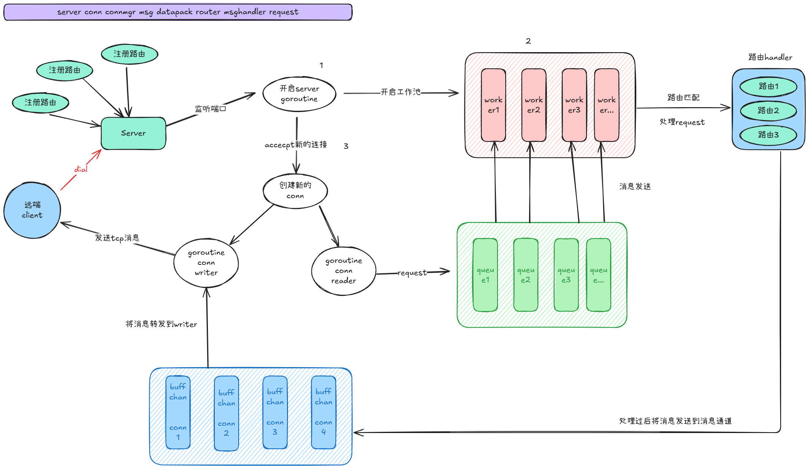

# Zinx TCP 框架学习项目

## 项目介绍

Zinx 是一个基于 Go 语言开发的轻量级 TCP 服务器框架，主要用于学习和理解网络编程的核心概念。本项目是 Zinx 框架的学习实现，包含了完整的 TCP 服务器框架功能。

## 架构图


这里展示了 Zinx 框架的架构图设计,包括各个组件的关系和数据流转.

## 功能特性

### 核心功能

- **多路由支持**: 支持基于消息 ID 的多路由处理
- **连接管理**: 完整的连接生命周期管理
- **消息封装**: 自定义消息格式和数据包封装
- **异步处理**: 支持异步消息处理机制
- **连接钩子**: 连接建立和断开时的回调函数

### 架构设计

- **接口驱动**: 基于接口的设计，易于扩展
- **模块化**: 清晰的模块划分，职责分离
- **可配置**: 支持配置文件管理服务器参数

## 项目结构

```
zinx-learn/
├── cmd/                    # 示例程序
│   ├── client/            # 客户端示例
│   └── server/            # 服务器示例
├── conf/                  # 配置文件
│   └── zinx.json         # 服务器配置
├── logger/               # 日志模块
├── utils/                # 工具类
│   └── globalobj.go      # 全局配置对象
├── ziface/               # 接口定义
│   ├── iconnection.go    # 连接接口
│   ├── Iconnmanager.go   # 连接管理器接口
│   ├── idatapack.go      # 数据包接口
│   ├── imessage.go       # 消息接口
│   ├── imsghandler.go    # 消息处理器接口
│   ├── irequest.go       # 请求接口
│   ├── irouter.go        # 路由接口
│   └── iserver.go        # 服务器接口
└── znet/                 # 网络实现
    ├── connection.go     # 连接实现
    ├── connmanager.go    # 连接管理器实现
    ├── datapack.go       # 数据包实现
    ├── message.go        # 消息实现
    ├── msghandler.go     # 消息处理器实现
    ├── request.go        # 请求实现
    ├── router.go         # 路由实现
    └── server.go         # 服务器实现
```

## 快速开始

### 环境要求

- Go 1.25.1 或更高版本

### 安装和运行

1. **克隆项目**

```bash
git clone https://github.com/takeboat/zinx-learn.git
cd zinx-learn
```

2. **启动服务器**

```bash
go run cmd/server/main.go
```

3. **启动客户端**（新开终端）

```bash
go run cmd/client/main.go
```

### 配置说明

配置文件位于 `conf/zinx.json`，可以配置以下参数：

- 服务器名称
- 监听地址和端口
- 最大连接数
- 数据包大小限制
- 工作池大小等

## 使用示例

### 创建自定义路由

```go
package main

import (
    "fmt"
    "zinx/ziface"
    "zinx/znet"
)

type MyRouter struct {
    znet.BaseRouter
}

func (r *MyRouter) PreHandle(request ziface.IRequest) {
    fmt.Println("前置处理")
}

func (r *MyRouter) Handle(request ziface.IRequest) {
    fmt.Println("处理业务逻辑")
    // 处理消息
    msgId := request.GetMsgID()
    data := request.GetData()
    fmt.Printf("收到消息ID: %d, 数据: %s\n", msgId, string(data))

    // 发送响应
    request.GetConnection().SendMsg(1, []byte("响应消息"))
}

func (r *MyRouter) PostHandle(request ziface.IRequest) {
    fmt.Println("后置处理")
}
```

### 创建服务器并添加路由

```go
func main() {
    server := znet.NewServer("[Zinx Server]")

    // 设置连接钩子
    server.SetOnConnStart(func(conn ziface.IConnection) {
        fmt.Println("连接建立:", conn.GetConnID())
    })

    server.SetOnConnStop(func(conn ziface.IConnection) {
        fmt.Println("连接断开:", conn.GetConnID())
    })

    // 添加路由
    server.AddRouter(1, &MyRouter{})
    server.AddRouter(2, &AnotherRouter{})

    // 启动服务器
    server.Serve()
}
```

## 核心接口说明

### IServer 服务器接口

- `Start()` - 启动服务器
- `Stop()` - 停止服务器
- `Serve()` - 运行服务器
- `AddRouter()` - 添加路由
- `GetConnMgr()` - 获取连接管理器

### IConnection 连接接口

- `Start()` - 启动连接
- `Stop()` - 停止连接
- `SendMsg()` - 发送消息
- `GetConnID()` - 获取连接 ID
- `SetProperty()` - 设置连接属性

### IRouter 路由接口

- `PreHandle()` - 前置处理
- `Handle()` - 业务处理
- `PostHandle()` - 后置处理

## 消息协议

Zinx 使用自定义的消息协议格式：

```
+--------+--------+--------+--------+--------+
| 数据长度 | 消息ID  |       数据内容         |
| 4字节   | 4字节   |     数据长度字节       |
+--------+--------+--------+--------+--------+
```

## 开发指南

### 扩展功能

1. **添加新的消息类型**: 实现新的路由处理器
2. **自定义数据包格式**: 实现 `IDataPack` 接口
3. **添加中间件**: 在路由处理前后添加处理逻辑
4. **集成数据库**: 在路由处理中访问数据库

### 最佳实践

- 在 `PreHandle` 中进行参数验证
- 在 `Handle` 中处理核心业务逻辑
- 在 `PostHandle` 中进行资源清理
- 合理使用连接属性存储会话信息

## 参考资源

- [Zinx 官方文档](https://github.com/aceld/zinx)
- [Go 网络编程](https://golang.org/pkg/net/)
